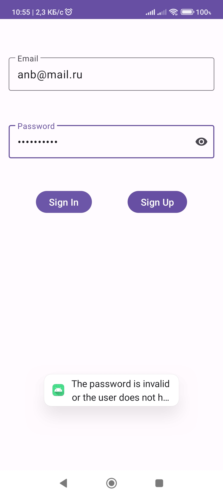
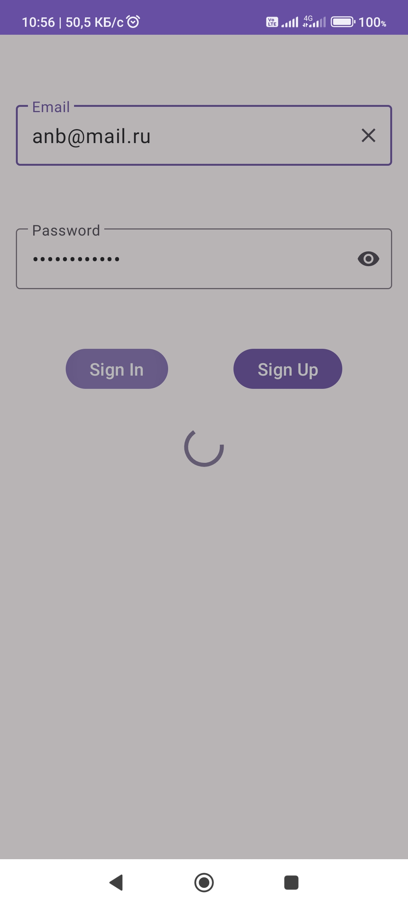
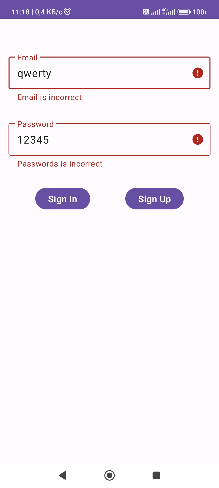
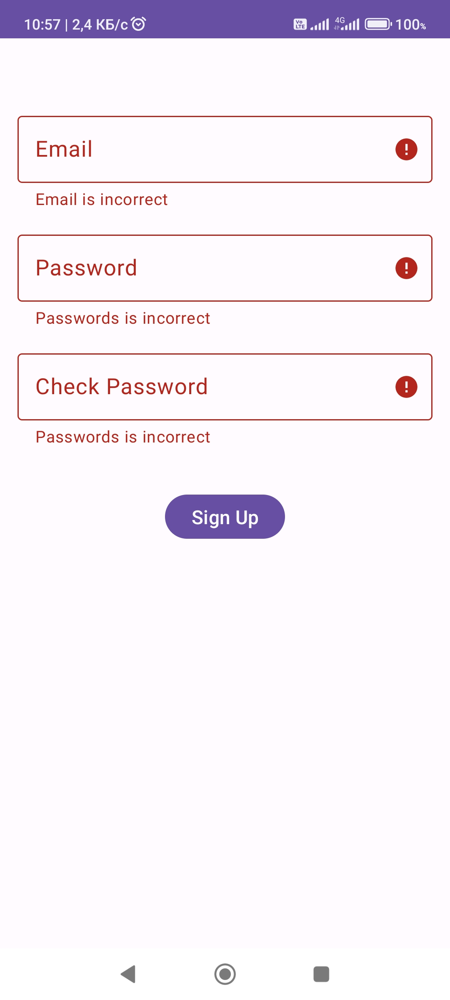
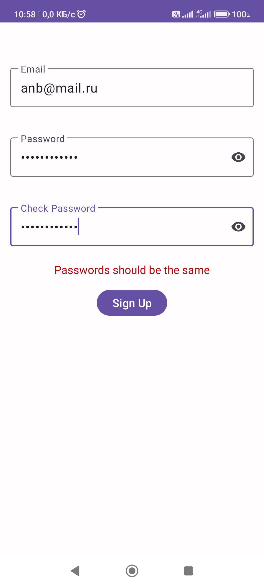
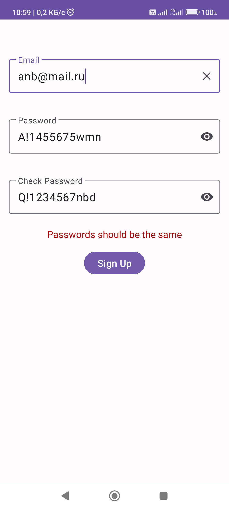

## Password App

Приложение в котором демонстрируется использование Custom View для экранов авторизации и регистрации.
Авторизация и регистрация происходит в Firebase.
Custom View содержит собственную логику обработки полей email и password.
Для запуска на своем устройстве вам понадобится свой google-services.json.

### Стек технологий

ViewBinding

Lifecycle

Livedata

Navigation Component

Firebase

Hilt

### Скриншоты

